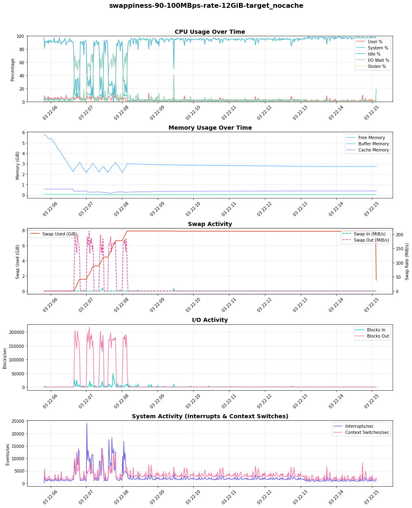
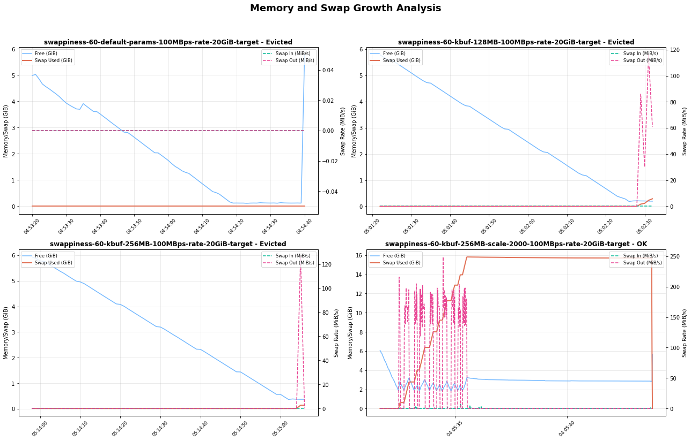
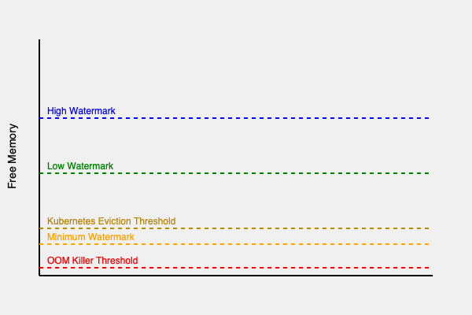

Swap is a linux feature that provides additional virtual memory by using disk storage when physical RAM is exhausted, allowing the kernel to move less-frequently accessed memory pages to disk. While traditionally disabled in Kubernetes for performance predictability, the [NodeSwap feature](https://kubernetes.io/docs/concepts/cluster-administration/swap-memory-management/) now enables controlled swap usage to improve resource utilization and reduce out-of-memory (OOM) kills.

However, enabling swap is not a "turn-key" solution. The performance and stability of your nodes under memory pressure are critically dependent on a set of Linux kernel parameters. Misconfiguration can lead to performance degradation or even interfere with Kubelet's eviction logic.

In this blogpost, we'll dive into  critical Linux kernel parameters that govern swap behavior. We will explore how these parameters influence Kubernetes workload performance, swap utilization, and crucial eviction mechanisms. We will present various test results showcasing the impact of different configurations, and share our findings on achieving optimal settings for stable and high-performing Kubernetes clusters.

## Key kernel parameters for swap tuning

First, let us understand the main Linux knobs you can control to control swap behavior. These are typically set using `sysctl`.

* `vm.swappiness`: This is the most well-known parameter. It is a value from 0 to 200 (100 in older kernels) that controls the kernel's preference for swapping anonymous memory pages versus reclaiming file-backed memory pages (page cache).
    * __High value (eg: 90+)__: The kernel will be aggressive in swapping out less-used anonymous memory to make room for file-cache.
    * __Low value (eg: < 10)__: The kernel will strongly prefer dropping file cache pages over swapping anonymous memory.
* `vm.min_free_kbytes`: This parameter tells the kernel to keep a minimum amount of memory free as a buffer. When the amount of free memory drops below the this safety buffer, the kernel starts more aggressively reclaiming pages (swapping, and eventually handling OOM kills).
    * __Function:__ It acts as a safety lever to ensure the kernel has enough memory for critical allocation requests that cannot be deferred.
    * __Impact on swap__: Setting a higher `min_free_kbytes` effectively raises the floor for for free memory, causing the kernel to initiate swap earlier under memory pressure.
* `vm.watermark_scale_factor`: This setting controls the gap between different watermarks: `min`, `low` and `high`, which are calculated based on `min_free_kbytes`.
    * __Watermarks explained__:
        * `low`: When free memory is below this mark, the `kswapd` kernel process wakes up to reclaim pages in the background. This is when a swapping cycle begins.
        * `min`: When free memory hits this minimum level, then aggressive page reclamation will block process allocation. Failing to reclaim pages will cause OOM kills.
        * `high`: Memory reclamation stops once the free memory reaches this level.
    * __Impact__: A higher `watermark_scale_factor` careates a larger buffer between the `low` and `min` watermarks. This gives `kswapd` more time to reclaim memory gradually before the system hits a critical state.

In a typical server workload, you might have a long-running process with some memory that becomes 'cold'. A higher `swappiness` can help cache disk I/O for other active processes by swapping out the cold memory.

Tuning the `min_free_kbytes` and `watermark_scale_factor` parameters to move the swapping window early will give more room for `kswapd` to offload memory to disk and prevent OOM kills during sudden memory spikes.

## Swap tests and results

To understand the real-impact of these parameters, we designed a series of stress tests.

### Test setup
* __Environment__: GKE on Google Cloud
* __Kubernetes version__: 1.33.2
* __Node configuration__: `n2-standard-2` (8GB RAM, 50GB swap), Ubuntu 22.04
* __Workload__: A custom Go application (simple-swap-test) designed to allocate memory at a configurable rate, generate file-cache pressure, and simulate different memory access patterns (random vs sequential).
* __Monitoring__: A sidecar container capturing system metrics every second.
* __Protection__: Critical system components (Kubelet, container runtime, sshd) were prevented from swapping by setting `memory.swap.max=0` in their respective cgroups.

### Test methodology

We ran our stress-test pod on nodes with different swappiness settings (0, 60, and 90) and varied the min_free_kbytes and watermark_scale_factor parameters to observe the outcomes under heavy memory allocation and I/O pressure.

#### Visualizing swap in action

The graph below, from a 100MBps stress test, shows swap in action. As free memory (in the "Memory Usage" plot) decreases, swap usage (`Swap Used (GiB)`) and swap-out activity (`Swap Out (MiB/s)`) increase. Critically, as the system relies more on swap, the I/O activity and corresponding wait time (`IO Wait %` in the "CPU Usage" plot) also rises, indicating CPU stress.

### Findings

Our initial tests with default kernel parameters (`swappiness=60`, `min_free_kbytes=68MB`, `watermark_scale_factor=10`) quickly led to OOM kills and even unexpected node restarts under high memory pressure. With selecting appropriate kernel parameters a good balance in node stability and performance can be achieved.

#### The impact of `swappiness`

The swappiness parameter directly influences the kernel's choice between reclaiming anonymous memory (swapping) and dropping page cache. To observe this, we ran a test where one pod generated and held file-cache pressure, followed by a second pod allocating anonymous memory at 100MB/s, to observe the kernel preference on reclaim:

Our findings reveal a clear trade-off:

* `swappiness=90`: The kernel proactively swapped out the inactive anonymous memory to keep the file cache. This resulted in high and sustained swap usage and significant I/O activity ("Blocks Out"), which in turn caused spikes in I/O wait on the CPU. 
* `swappiness=0`: The kernel favored dropping file-cache pages delaying swap consumption.  However, it's critical to understand that this **does not disable swapping**. When memory pressure was high, the kernel still swapped anonymous memory to disk.

The choice is workload-dependent. For workloads sensitive to I/O latency, a lower swappiness is preferable. For workloads that rely on a large and frequently accessed file cache, a higher swappiness may be beneficial, provided the underlying disk is fast enough to handle the load.

#### Tuning watermarks to prevent eviction and OOM kills

The most critical challenge we encountered was the interaction between rapid memory allocation and Kubelet's eviction mechanism. When our test pod allocated memory at a high rate (e.g., 300-500 MBps), the system quickly ran out of free memory.

With default watermarks, the buffer for reclamation was too small. Before `kswapd` could free up enough memory by swapping, the node would hit a critical state, leading to two potential outcomes:

1. __Kubelet eviction__: If Kubelet's eviction manager detected `memory.available` was below its threshold, it would evict the pod.
2. __OOM killer__: In some high-rate scenarios, the OOM Killer would activate before eviction could complete, sometimes killing higher priority pods that were not the source of the pressure.

To mitigate this we tuned the watermarks:
1. Increased `min_free_kbytes` to 512MB: This forces the kernel to start reclaiming memory much earlier, providing a larger safety buffer.
2. Increased `watermark_scale_factor` to 2000: This widened the gap between the `low` and `high` watermarks (from ~337MB to ~591MB in our test node's `/proc/zoneinfo`), effectively increasing the swapping window.

This combination gave `kswapd` a larger operational zone and more time to swap pages to disk during memory spikes, successfully preventing both premature evictions and OOM kills in our test runs.

Table compares watermark levels from `/proc/zoneinfo` (Non-NUMA node):

| `min_free_kbytes=68MB` and `watermark_scale_factor=10` | `min_free_kbytes=512MB` and `watermark_scale_factor=2000`|
| -------- | -------- |
|Node 0, zone   Normal   &nbsp; pages free     583273   &nbsp; boost    0   &nbsp; min      10504   &nbsp; low      13130   &nbsp; high     15756   &nbsp; spanned  1310720   &nbsp; present  1310720   &nbsp; managed  1265603 | Node 0, zone   Normal   &nbsp; pages free     470539   &nbsp; min      82109   &nbsp; low      337017   &nbsp; high 591925  &nbsp; spanned  1310720  &nbsp; present  1310720   &nbsp; managed  1274542 |

The graph below reveals that the kernel buffer size and scaling factor play a crucial role in determining how the system responds to memory load. With the right combination of these parameters, the system can effectively use swap space to avoid eviction and maintain stability.

### Risks and recommendations

Enabling swap in Kubernetes is a powerful tool, but it comes with risks that must be managed through careful tuning.

* __Risk of performance degradation__: Swapping is orders of magnitude slower than accessing RAM. If an application's active working set is swapped out, its performance will suffer dramatically due to high I/O wait times (thrashing). Swap could preferably be provisioned with a SSD backed storage to improve performance.

* __Risk of masking memory leaks__: Swap can hide memory leaks in applications, which might otherwise lead to a quick OOM kill. With swap, a leaky application might slowly degrade node performance over time, making the root cause harder to diagnose.

* __Risk of disabling evictions__: Kubelet proactively monitors the node for memory-pressure and terminates pods to reclaim the resources. Improper tuning can lead to OOM kills before Kubelet has a chance to evict pods gracefully. A properly configured `min_free_kbytes` is essential to ensure Kubelet's eviction mechanism remains effective.

### Kubernetes context:

Together, the kernel watermarks and Kubelet eviction threshold create a series of memory pressure zones on a node. The eviction-threshold parameters need to be adjusted to configure kubernetes managed evictions occur before the OOM kills.

As the diagram shows, an ideal configuration will be to create a large enough 'swapping zone' (between `high` and `min` watermarks) so that the kernel can handle memory pressure by swapping before available memory drops into the Eviction/Direct Reclaim zone.

### Our recommended starting point

Based on our findings, we recommend the following as a starting point for nodes with swap enabled. You must benchmark this with your own workloads.

* `vm.swappiness=60`: Linux default encourages the kernel to swap out inactive memory, which is often desirable for multi-tenant nodes running diverse workloads.
* `vm.min_free_kbytes=500000` (500MB): Set this to a reasonably high value (e.g., 2-3% of total node memory) to give the node a reasonable safety buffer.
* `vm.watermark_scale_factor=2000`: Create a larger window for `kswapd` to work with, preventing OOM kills during sudden memory allocation spikes.

We encourage running benchmark tests with your own workloads in test-environments, when setting up swap for the first time in your Kubernetes cluster. Swap performance can be sensitive to different environment differences such as CPU load, disk type (SSD vs HDD) and I/O patterns.